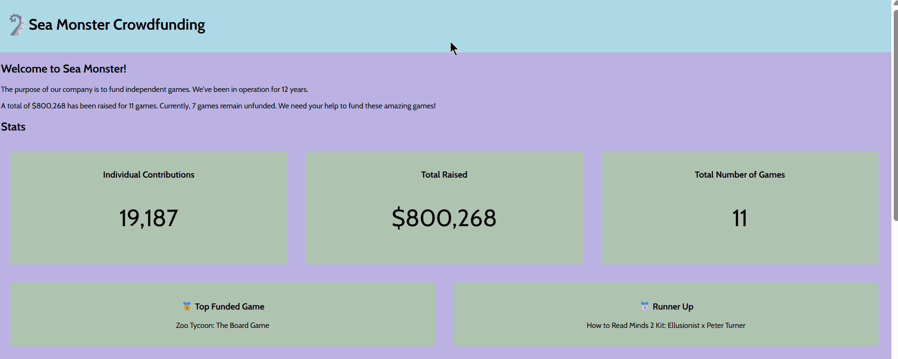

# WEB102 Prework - *Sea Monster X*

Submitted by: **Amanda Buleu**

**Sea Monster X** is a website for the company Sea Monster Crowdfunding that displays information about the games they have funded.

Time spent: **5** hours spent in total

## Required Features

The following **required** functionality is completed:

* [ ] The introduction section explains the background of the company and how many games remain unfunded.
* [ ] The Stats section includes information about the total contributions and dollars raised as well as the top two most funded games.
* [ ] The Our Games section initially displays all games funded by Sea Monster Crowdfunding
* [ ] The Our Games section has three buttons that allow the user to display only unfunded games, only funded games, or all games.

The following **optional** features are implemented:

* [ ] Added a search option to find specific games from the list.

## Video Walkthrough

Here's a walkthrough of implemented features:

<!-- Replace this with whatever GIF tool you used! -->
GIF created with ScreenToGif https://www.screentogif.com/
<!-- Recommended tools:
[Kap](https://getkap.co/) for macOS
[ScreenToGif](https://www.screentogif.com/) for Windows
[peek](https://github.com/phw/peek) for Linux. -->
Imported game data and created a function to remove all child elements from a DOM parent.

Dynamically displayed each game as a card with image, name, and description on the page.

Calculated and displayed total contributions, total dollars raised, and number of games.

Added buttons to filter funded, unfunded, or all games dynamically.

Displayed the top two funded games using sorting and destructuring.
Added a search bar for ease of finding the game using event listeners + filter + includes + toLowerCase + DOM manipulation.
## Notes

Minor challenges happened like figuring out how to make the search option appear and match the theme of the page. As well as making sure codes were right, and functional. Figuring out how to use git -m and git push were something new to learn how to do.

## License

    Copyright 2026 Amanda Buleu

    Licensed under the Apache License, Version 2.0 (the "License");
    you may not use this file except in compliance with the License.
    You may obtain a copy of the License at

        http://www.apache.org/licenses/LICENSE-2.0

    Unless required by applicable law or agreed to in writing, software
    distributed under the License is distributed on an "AS IS" BASIS,
    WITHOUT WARRANTIES OR CONDITIONS OF ANY KIND, either express or implied.
    See the License for the specific language governing permissions and
    limitations under the License.
